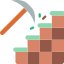

MinecraftJars.NET
======

<p>
  <a href="https://github.com/tekgator/MinecraftJars.NET/blob/main/LICENSE" alt="License">
    
  </a>
  
  <a href="https://www.nuget.org/packages/MinecraftJars.NET" alt="Nuget">
    
  </a>
  <a href="https://github.com/tekgator/MinecraftJars.NET/actions/workflows/build-on-push.yml" alt="BuildStatus">
    
  </a>
  <a href="https://github.com/tekgator/MinecraftJars.NET/releases" alt="Releases">
    
  </a>
  <a href="https://github.com/tekgator/MinecraftJars.NET/releases" alt="Releases">
    
  </a>
  <a href="https://github.com/tekgator/MinecraftJars.NET/commit" alt="Commit">
    
  </a>
</p>

MinecraftJars.NET is a library to give .NET developers easy access for available Minecraft server version as well as Bedrock edition and Proxies. 
The motivation for the library is actually a server manager I'm currently working on which will allow to download the latest and greatest Minecraft server version within the manager.

While this repository is providing already the plugins to gather the most popular Minecraft server providers and server, it is easily extendable via the MEF Framework. 
A developer guide will follow, but I'm pretty sure the geeks will find out themselves on how to do it.

## Support

I try to be responsive to [Stack Overflow questions in the `minecraftjar-net` tag](https://stackoverflow.com/questions/tagged/minecraftjar-net) and [issues logged on this GitHub repository](https://github.com/tekgator/MinecraftJar.NET/issues).

If I've helped you and you like some of my work, feel free to buy me a coffee ☕ (or more likely a beer 🍺)

[](https://ko-fi.com/C0C7LO3V1)

## Plugins

Following provider plugins are already bundled with MinecraftJars.NET:

&nbsp;[Mojang](MinecraftJars.Plugin/MinecraftJars.Plugin.Mojang) 
- Vanilla
- Vanilla Snapshot
- Bedrock
- Bedrock Preview

&nbsp;[Mohist](MinecraftJars.Plugin/MinecraftJars.Plugin.Mohist)
  - Mohist

&nbsp;[Paper](MinecraftJars.Plugin/MinecraftJars.Plugin.Paper)
- Paper
- Folia
- Velocity
- Waterfall

&nbsp;[Purpur](MinecraftJars.Plugin/MinecraftJars.Plugin.Purpur)
- Purpur

&nbsp;[Spigot](MinecraftJars.Plugin/MinecraftJars.Plugin.Spigot)
- Spigot &rarr; **Important:** see details in Plugin Readme
- BungeeCord

## Installing

Multiple options are available to install within your project:

1. Install, using the [Nuget Gallery](https://www.nuget.org/packages/MinecraftJars.NET)

2. Install using the Package Manager Console:
   ```ps
   Install-Package MinecraftJars.NET 
   ```
3. Install using .NET CLI
   ```cmd
   dotnet add package MinecraftJars.NET
   ```

## Usage

MinecraftJars.NET comes with a `ProviderManager` class which has to be instantiated, optionally `ProviderOptions` can be supplied. 
Each Plugin provides an interface instance for the provider `IProvider` as well an interface instance for `IEnumerable<IProject>` with it's versions `IEnumerable<IVersion>`.
Since getting the actual download link mostly involves another API query it is accessible via the `IVersion.GetDownload()` method.

```CSharp
using MinecraftJars;

var providerManager = new ProviderManager();

foreach (var provider in providerManager.GetProviders())
{
    Console.WriteLine($"{provider}");

    foreach (var project in provider.Projects)
    {
        Console.WriteLine($"\t{project}");     
        
        foreach (var version in await provider.GetVersions(project.Name, new VersionOptions { MaxRecords = 10 }))
        {
            Console.WriteLine($"\t\t{version}");

            var download = await version.GetDownload();
            Console.WriteLine($"\t\t\t{download}");
        }
        
        Console.WriteLine();
    }
    
    Console.WriteLine();
}

```


### What provider / project / version information is the library providing?

To make a long story short have a look at the [`IProvider`](MinecraftJars.Core/Providers/IProvider.cs), [`IProject`](MinecraftJars.Core/Projects/IProject.cs), [`IVersion`](MinecraftJars.Core/Versions/IVersion.cs) and the [`IDownload`](MinecraftJars.Core/Downloads/IDownload.cs) interface to see what values are returned by default. 
Each plugin could provide more information, which can be found in the README.md of the corresponding plugin.

As an example with the Vanilla Minecraft experience following values are expected:
 - `IProvider` = Paper
   - `IEnumerable<IProject>` = Paper, Folia, Velocity, Waterfall
     - `IEnumerable<IVersion>` for Paper = 1.19.4, 1.19.3, 1.19.2, etc.
       - `IDownload` = Build 123  

**Please note:** 
- If a version has multiple builds only the latest successful build will be returned via `IVersion.GetDownload()` method.
- Not all providers will fill all properties in each interface instance. Further information are provided in the README.md of each plugin.


## Demo application

Have a look at the [Console Demo](MinecraftJars.Demo/MinecraftJars.Demo.Console) within the repository.
It will run straight out of the box to give you a hint what the library can do for you.


## Dependencies and Credits

- Teneko's [Teronis.DotNet](https://github.com/teneko/Teronis.DotNet/tree/develop/src/MSBuild/Packaging/ProjectBuildInPackage) for allowing project reference content to be added to the NuGet package during pack process

- Icons are provided by [Flat Icons](https://www.flaticon.com)
